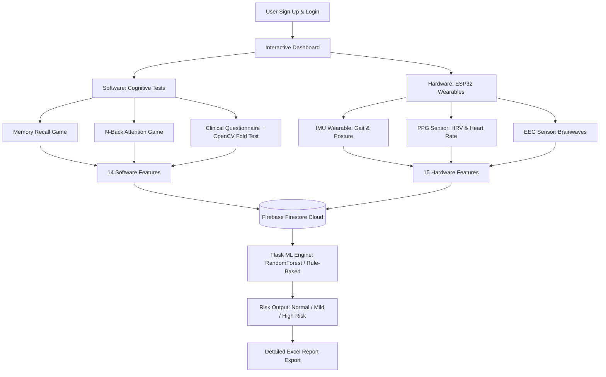

# INNOWAH (NeuroBand Plus) — Presentation Guide
## Alzheimer's Risk Prediction System

This document provides a concise, simple, and complete guide for presenting the **INNOWAH (NeuroBand Plus)** project. It covers all software, hardware, machine learning, and database parts of your application, formatted as slides with slide objectives, key talking points, and a Q&A prep section.

---

## Slide 1: Project Overview
* **Title:** INNOWAH (NeuroBand Plus): Multimodal Alzheimer's Risk Prediction System
* **Subtitle:** Non-invasive, early-stage screening combining cognitive tests and physiological telemetry
* **Objective:** Introduce the project, its core objective, and the technologies used.
* **Key Talking Points:**
  - **What it is:** A comprehensive web-based and IoT screening platform that predicts the risk of Alzheimer's disease.
  - **The Approach:** Rather than relying on a single test, it combines **cognitive evaluation (Software)** and **physiological telemetry (Hardware)**.
  - **Tech Stack:** 
    - **Frontend:** HTML, Vanilla CSS, Vanilla JavaScript (responsive dashboard & games).
    - **Backend:** Flask (Python web server & REST APIs), OpenCV (image processing).
    - **Database & Sync:** Firebase Auth & Firestore (live cloud database).
    - **Machine Learning:** RandomForestClassifier (predicts risk level: Normal, Mild, High).

---

## Slide 2: Problem Statement & Solution
* **Title:** The Need for Early Screening
* **Objective:** Explain why this project is important and what problem it solves.
* **Key Talking Points:**
  - **The Problem:** Clinical diagnosis of Alzheimer's (like MRI, PET scans, or CSF analysis) is expensive, invasive, and usually done *after* symptoms become severe.
  - **Our Solution:** A low-cost, non-invasive, home-based screening system.
  - **The Value:** By analyzing cognitive performance alongside vitals (heart, brain, motion), the platform flags early indicators of cognitive decline, allowing for early clinical intervention.

---

## Slide 3: System Architecture & Workflow
* **Title:** How It Works: End-to-End Workflow
* **Objective:** Walk through the system architecture simply.
* **Mermaid Flow Diagram:**

* **Key Talking Points:**
  - **Data Sources:** We gather 14 software (cognitive) features and 15 hardware (sensor) features.
  - **Synchronization:** The user registers, linking their account to an ESP32 Device ID. Vitals are synced via Firestore in real time.
  - **Inference:** The backend merges these features into a 31-dimensional normalized vector and feeds it to the machine learning engine to calculate the risk score.

---

## Slide 4: Part 1 — Software & Cognitive Assessments
* **Title:** Cognitive Games & Computer Vision
* **Objective:** Detail the interactive tests the user performs on the website.
* **Key Talking Points:**
  - **Memory Recall Game (`memory.html`):** A card-matching game that measures immediate recall, delayed recall, and efficiency.
  - **N-Back Game (`n-back.html`):** A sequence memory task that calculates reaction time, working memory accuracy, and error consistency.
  - **Questionnaire & CV (`questionnaire.html`):**
    - A clinical questionnaire measuring orientation, language, attention, and daily activity.
    - **OpenCV Computer Vision Test:** The user takes a picture of a folded piece of paper. The backend uses edge detection (`Canny`) and symmetry analysis (`cv2.absdiff`) to verify if the paper was correctly folded (testing motor and visuospatial planning).

---

## Slide 5: Part 2 — Hardware & Physiological Telemetry
* **Title:** Sensor Suite & IoT Integration
* **Objective:** Explain the wearable sensors and what they measure.
* **Key Talking Points:**
  - **IMU Sensor (Gait & Posture):** Tracks gait speed, stride variability, turning velocity, postural sway, and daily steps.
  - **PPG Sensor (Autonomic Health):** Tracks heart rate, oxygen levels ($SpO_2$), and heart rate variability metrics (RMSSD, SDNN) to detect stress and autonomic dysfunction.
  - **EEG Sensor (Brainwave Activity):** Measures brain frequency powers (Alpha, Theta, Delta), the Theta/Alpha ratio, and dominant frequency, which are key biomarkers in neurodegenerative diseases.
  - **ESP32 Communication:** Wearable hardware uploads these metrics every 10 seconds directly to the server via REST APIs.

---

## Slide 6: Part 3 — Machine Learning & Explainable AI
* **Title:** The Prediction & Diagnostics Engine
* **Objective:** Explain how the risk is computed and presented.
* **Key Talking Points:**
  - **Feature Vector:** All 29 raw features are normalized between `0.0` (unhealthy) and `1.0` (healthy), along with 2 aggregate scores (Sensor health and Cognitive health).
  - **The ML Model:** A trained **RandomForest Classifier** calculates the probability for each risk class: Normal, Mild Risk, and High Risk.
  - **Fallback Clinical Engine:** If the ML model files are missing, the system utilizes a clinical rule-based engine mapping thresholds for each parameter.
  - **Explainability:** The dashboard breaks down results into 5 specific cognitive domains: **Memory, Reasoning, Visuospatial, Language, and Behavior**. It generates automated, actionable recommendations based on the risk level.

---

## Slide 7: Part 4 — Live Demo Highlights
* **Title:** Web Features & Data Export
* **Objective:** Describe what the examiner will see during the live demo.
* **Key Talking Points:**
  - **Firebase Authentication:** Secure login/signup linking the user profile.
  - **Real-Time Indicators:** The dashboard shows a "Device Connected" toast notification the moment the ESP32 starts transmitting.
  - **Dynamic Gauge:** Results are displayed in a clean, modern dashboard with interactive graphs and gauges.
  - **Report Export:** Users can download a full, multi-sheet **Excel report** containing their 5-minute raw hardware history, software cognitive metrics, and clinical recommendations.

---

## Slide 8: Summary of Achievements
* **Title:** Summary & Key Takeaways
* **Objective:** Conclude with the main highlights of the project.
* **Highlights:**
  1. **Multimodal Screening:** Uniquely combines physiological vitals (EEG/PPG/IMU) with cognitive games.
  2. **Computer Vision Integration:** Incorporates paper-folding verification via OpenCV.
  3. **Explainable AI:** Provides domain-specific scores rather than a black-box percentage.
  4. **Production-Ready Architecture:** Live synchronization between ESP32 hardware, Firebase, and a Flask server, complete with a structured Excel report exporter.

---

## Key Q&A Prep for Examiners

### Q1: Why did you use Random Forest for this model?
* **Answer:** Random Forest is excellent for clinical tabular data because it is highly robust against overfitting, handles small datasets well, and handles missing/imputed feature values gracefully. It also allows us to extract feature importances, making the model more explainable.

### Q2: What happens if a user doesn't have the wearable hardware?
* **Answer:** The app uses imputation (setting missing sensor parameters to a baseline neutral value of `0.5`). The model or the rule-based clinical engine can still calculate a prediction based entirely on the software cognitive games and questionnaire.

### Q3: How does the OpenCV paper-folding test work?
* **Answer:** It uses base64 image uploading. The server converts it to grayscale, applies a Gaussian blur, detects edges using Canny edge detection, and counts linear structures using a Hough Line Transform. It also calculates horizontal symmetry by dividing the image in half, flipping one half, and computing the absolute difference (`cv2.absdiff`). A high symmetry and presence of horizontal/vertical lines indicate a properly folded paper.

### Q4: How do the ESP32 and the Web App communicate?
* **Answer:** The ESP32 acts as an HTTP client sending JSON payloads to the Flask API endpoint `/api/hardware_data` every 10 seconds. The web app requests updates from `/get_data` via AJAX polling to update the dashboard UI in real time. Both sync their persistent states using Firestore database collection structures.
